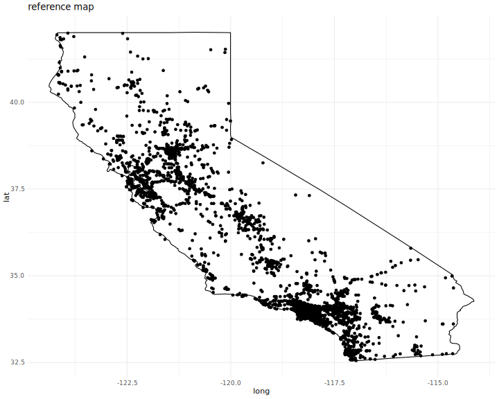

# README

<div>

[](https://app.travis-ci.com/Karrrramba/FARSanalyzr)

Build Status

</div>

# FARSanalyzr

FARSanalyzr is an R package for analyzing data from the Fatality
Analysis Reporting System (FARS). For more information about the
Fatality Analysis Reporting System (FARS), you can visit the [FARS
website](https://www.nhtsa.gov/research-data/fatality-analysis-reporting-system-fars).

## Installation

You can install the latest version of FARSanalyzr from GitHub using the
`devtools` package:

``` r
devtools::install_github("Karrrramba/FARSanalyzr")
```

## Usage

### Reading FARS data

You can read FARS data for specific years using the fars_read_years
function:

``` r
library(FARSanalyzr)

# Read FARS data for the year 2013
data_2013 <- fars_read_years(2013)
```

The package comes with the FARS datasets for the years 2013 and 2014,
respectively. Here is how you can access these using the `system.file()`
function:

``` r
accidents_2014 <- system.file("extdata", "accidents_2014.csv.bz2", package = "FARSanalyzr")
```

### Summarizing FARS data

`fars_summarize_years` allows you to summarize accidents for each month
across several years in a single table.

### Mapping FARS data

You can visualize FARS data on a map using the fars_map_state function:

``` r
# Map FARS data for the state of California in 2013
fars_map_state(state = 6, year = 2013)
```


